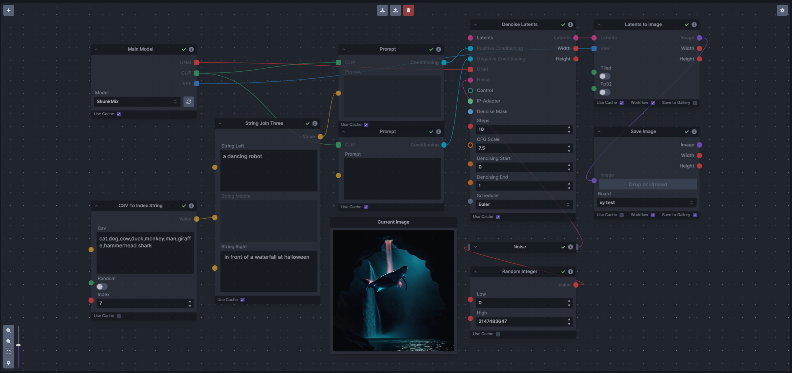

# Prompt-tools-nodes
A set of InvokeAI nodes that add general prompt (string) manipulation tools.  These where written to accompany the PromptsFromFile node and other prompt generation nodes.

|Node|Description|
|---|---|
|`Prompt To File`|saves a prompt or collection of prompts to a file. one per line. There is an append/overwrite option.|
|`PT Fields Collect`|Converts image generation fields into a Json format string that can be passed to Prompt to file.|
|`PT Fields Expand`|Takes Json string and converts it to individual generation parameters This can be fed from the Prompts to file node|
|`Prompt Strength`|Takes a string and float and outputs another string in the format of (string)strength like the weighted format of compel. |
|`Prompt Strength Combine`|This takes a collection of prompt strength strings and outputs a string in the .and() or .blend() format that can be fed into a proper prompt node.|
|`CSV To Index String`|Takes a CSV an index and outputs a random string. Includes a Random index option|

The following Nodes are now included in v3.2 of Invoke (as part of [PR-#3964](https://github.com/invoke-ai/InvokeAI/pull/3964)). These have now been removed from this set of tools.<br>
`Prompt Join` has become `String Join`<br>
`Prompt Join Three` has become `String Join Three`<br>
`Prompt Replace` has become `String Replace`<br>
`Prompt Split Neg` has become `String Split Neg`<br>

For the near future there is a backup copy of the 3.1.1 version before the move of some of the tools to core [prompt_tools_311.py](prompt_tools_311.py).  **Warning** DO NOT use both versions at once as it will cause problems. 

## Usage
If you want to use these nodes then you will have to place the [prompt_tools.py](prompt_tools.py) file in the folder `".venv\Lib\site-packages\invokeai\app\invocations"`. 


## Discord Link
The discord link for discussion is :- [Prompt-Tools](https://discord.com/channels/1020123559063990373/1134084151386058803) .

## ToDo
- Test the new PTFields nodes
- Add validation to nodes generally.
- workout how to add other fields like schedules, vae, models etc.

## PromptsToFile
`PromptsToFile` - Takes a filepath and a prompt or prompt collection and a bool for append/overwrite toggle.

Filepath:  This is the file that you want to be written to.  if the does not exist it will be created. Please be careful as there is no warning if a file already exists and will be overwritten.

Prompts: This accepts either a single prompt or a collection of prompts as input. 

Append: The defaults to append mode so the new prompts will just be appended to the end of the existing file. if this is disabled a new blank file will be created each time it is called. 

The large node graph below shows how you can use the Collect node make a collection of prompts during an iterate process.  This node graph goes a step further and places the negative inside [] like the old v2 way of doing things but has the benefit of keeping it to one line per prompt.


## PTFieldsCollect and PTFieldsExpand
Note: Both of the PTfields nodes should be easy to change to add or remove fields if the ones provided are not correct.

`PTFieldsCollect` - Converts image generation fields into a Json format string that can be passed to Prompt to file


`PTFieldsExpand` - Takes a json string and converts it to individual generation parameters


## PromptStrength and PromptStrengthsCombine
`PromptStrength` - converts a prompt and strength into compel style weighted string. Multiples of these then can be fed into a collect node to create a collection of them and the used with the 'PromptStrengthsCombine` node
```
e.g.
prompt: A blues sphere
strength: 1.2
output: (A blue sphere)1.2
```

`PromptStrengthsCombine` - converts a collection of PromptStrengths into a .and or .blend style string
```
e.g.
input: ["(cow)0.5","(Field)1.2","(stream)0.5"]
output: ("cow","Field","stream").and(0.5,1.2,0.5)
```


## CSV To Index String
`CSVToIndexString` - Takes a CSV string and and index and outputs a element from position index it as a string. If the index is out of range then it will wrap around. If the Random option is chosen the index will be chosen at random. 

This node could be used in conjunction with the `String Join` or `String Replace` nodes to build compound prompts. 

Or you could use it with a range node to step through the items in the csv.  As the index wraps around you could use input from an external random node without worrying about the range.

```
Examples:
CSV: one,two,three,four
random:false
index: 0
output: one

CSV: one,two,three,four
random:false
index: 2
output: three

CSV: one,two,three,four
random:false
index: 4
output: one

CSV: one,two,three,four
random:true
index: 0
output: Random output from csv list

```


